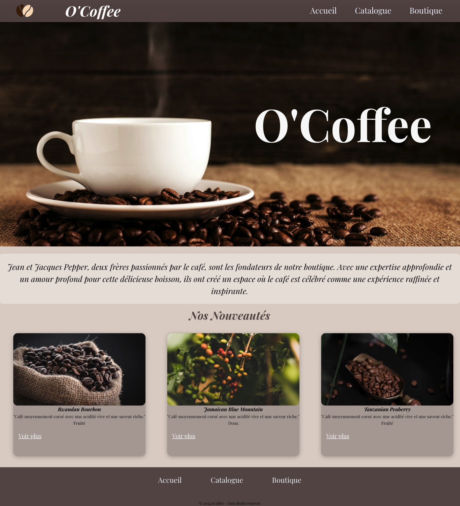
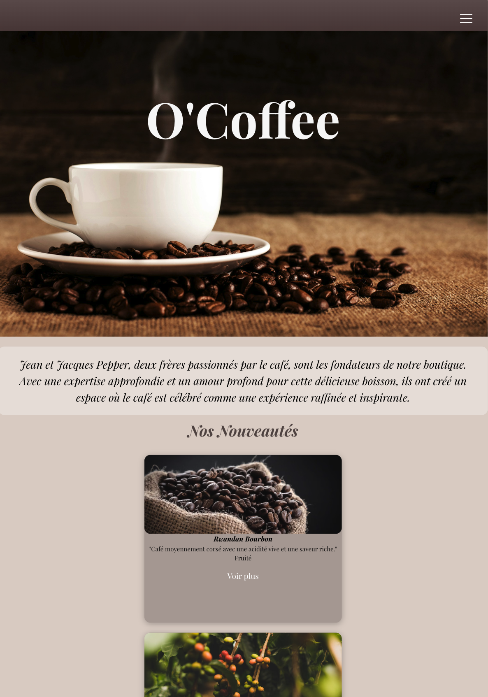
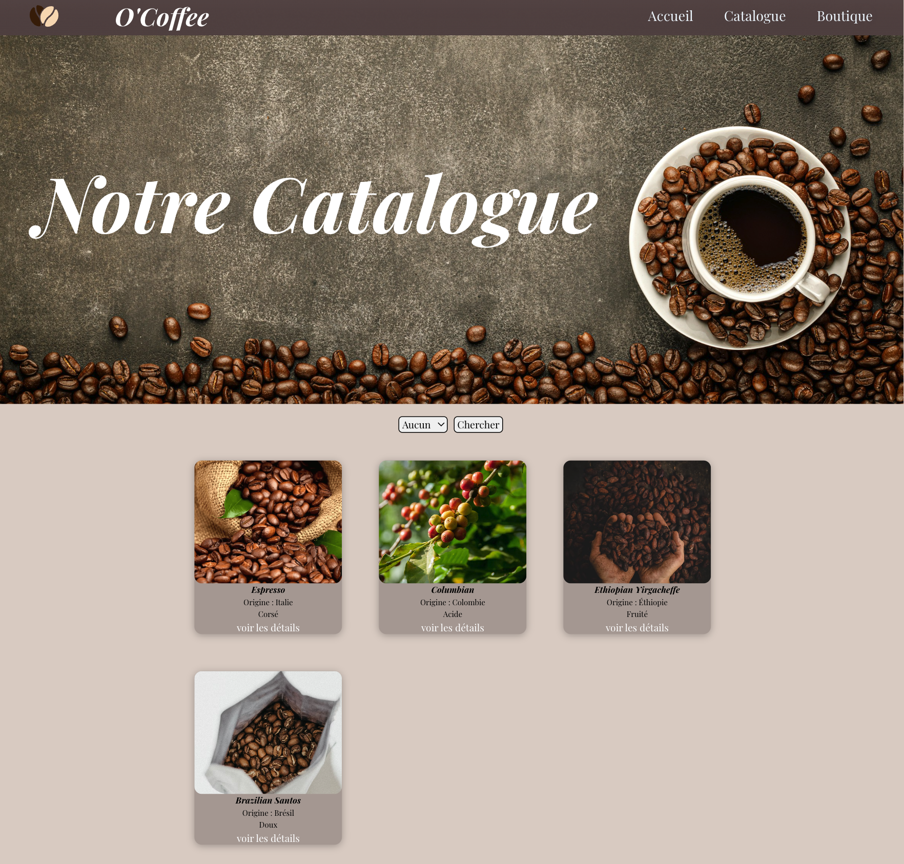
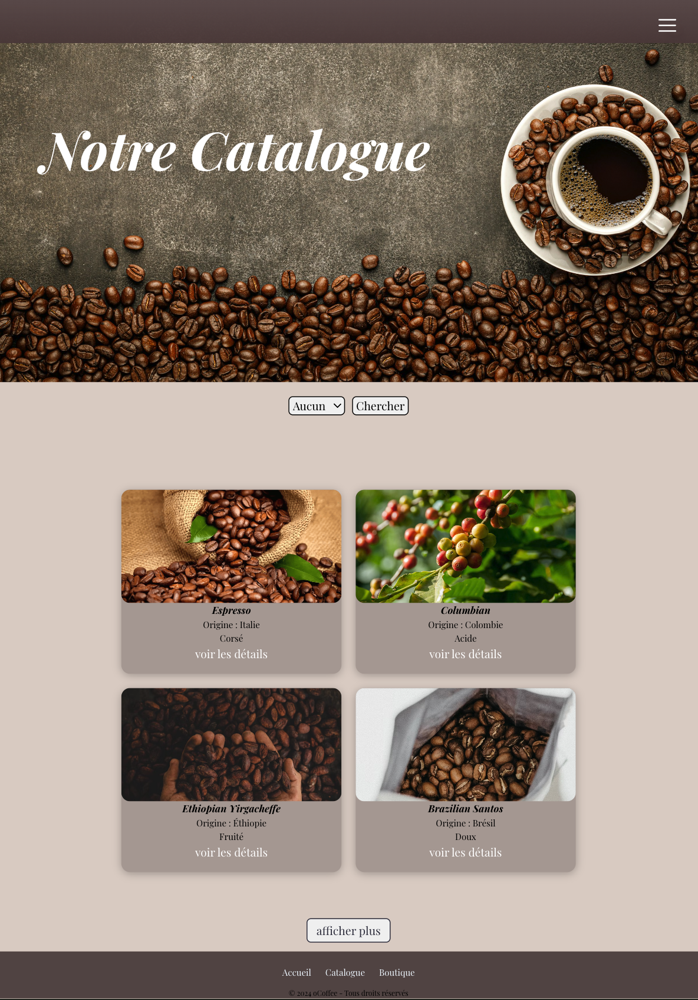

# site-Ocoffee

> Projet réalisé dans le cadre de ma formation développeur web chez O’clock.  
> L’objectif : répondre à un besoin client en affichant un catalogue de cafés et en offrant une navigation simple.
 
> Mettre en pratique le Templating EJS et les partials.
---

## 📸 Aperçu du projet

### Page d’accueil desktop et mobile
  

### Page Catalogue desktop et mobile avec choix des cafés
  

---

## ✨ Fonctionnalités principales

- 🔍 Affichage dynamique de cafés depuis une base de données
- 🔃 Tri des cafés par origine ou intensité
- 📄 Templates générés avec EJS (Embedded JavaScript)

---

## 🛠️ Technologies utilisées

- **Frontend** : HTML, CSS, JavaScript
- **Templating** : EJS
- **Backend** : Node.js + Express
- **BDD** : PostgreSQL

---
